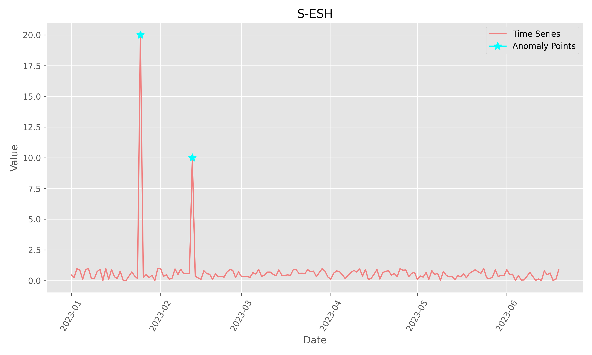

<p align="center" style="font-size:40px; margin:0px 10px 0px 10px">
    <em>[Py]S-ESD</em>
</p>
<p align="center">
    <em>Seasonal Extreme Studentized Deviate(S-ESD) in Python.
</em>
</p>

<div align="center">
  <a href="https://github.com/shenxiangzhuang/pysesd/actions/workflows/test.yaml" target="_blank">
      
  </a>

  <a href="https://github.com/shenxiangzhuang/pysesd">
  
  </a>

  <a href="#">
  
  </a>

  <a href="https://pypi.org/project/pysesd" target="_blank">
      
  </a>
  <a href="https://codecov.io/gh/shenxiangzhuang/pysesd" target="_blank">
      
  </a>

</div>

# About
Seasonal Extreme Studentized Deviate(S-ESD) in Python.

# Installation

Get latest version from PyPI:

```shell
pip install pysesd
```

# Examples

## Simple example
```python
from pysesd.dataset import load_synthetic_ts
from pysesd.sesd import SESD

ts = load_synthetic_ts()
sesd = SESD(alpha=0.05, hybrid=False, max_outliers=2)
outliers = sesd.fit(ts)
sesd.plot(save=True, fig_dir="../figures", fig_name="simple.png")
```


## Twitter example
```python
from pysesd.dataset import load_twitter_ts
from pysesd.sesd import SESD

ts = load_twitter_ts()
sesd = SESD(alpha=0.05, hybrid=True, max_outliers=int(len(ts) * 0.02))
outliers = sesd.fit(ts)
sesd.plot(save=True, fig_dir="../figures", fig_name="twitter.png")
```


# References
- [twitter/AnomalyDetection](https://github.com/twitter/AnomalyDetection)
